# Spend Wise - Smart Expense Tracker

A full-featured personal finance app built with React Native and Expo, powered by AI insights to help you track expenses, manage budgets, and grow your savings.

## Screenshots

### Authentication
<p align="center">
  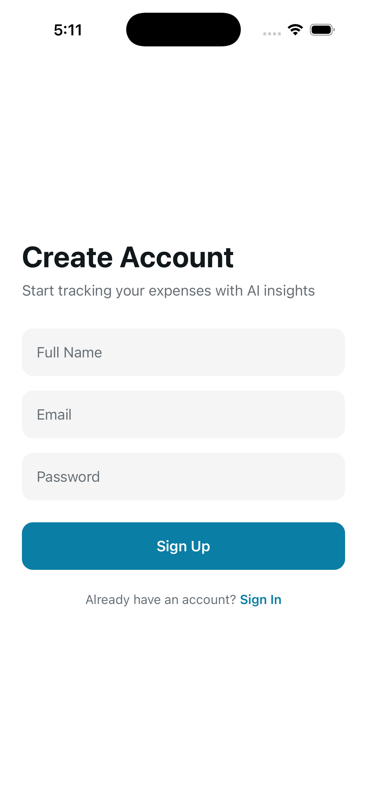
  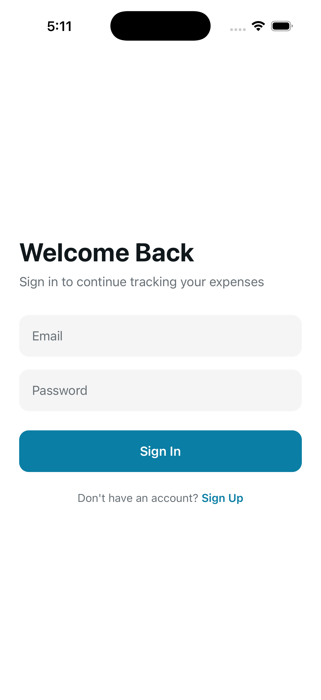
</p>

### Dashboard
<p align="center">
  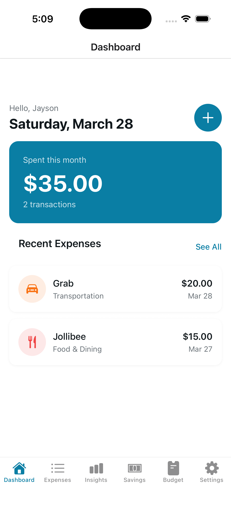
</p>

### Expense Tracking
<p align="center">
  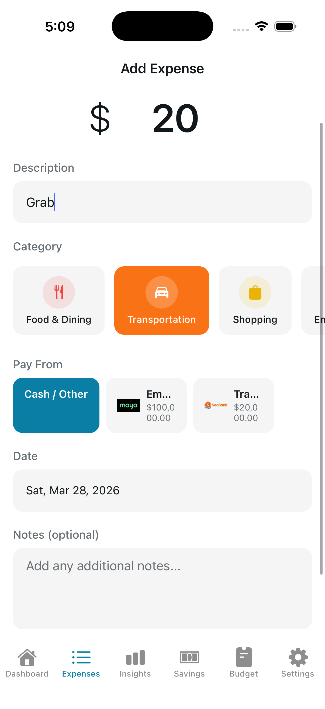
</p>

### AI Insights & Analytics
<p align="center">
  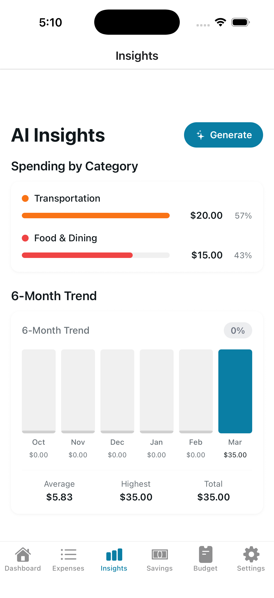
</p>

### Savings Management
<p align="center">
  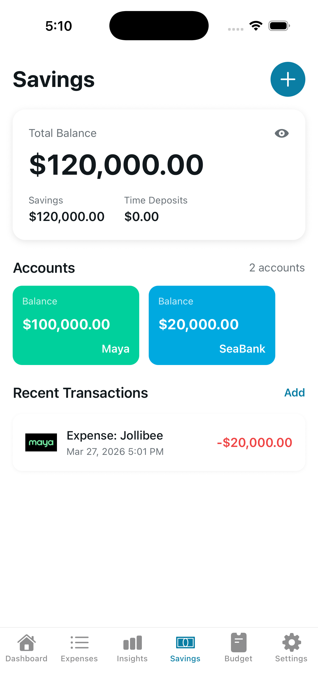
  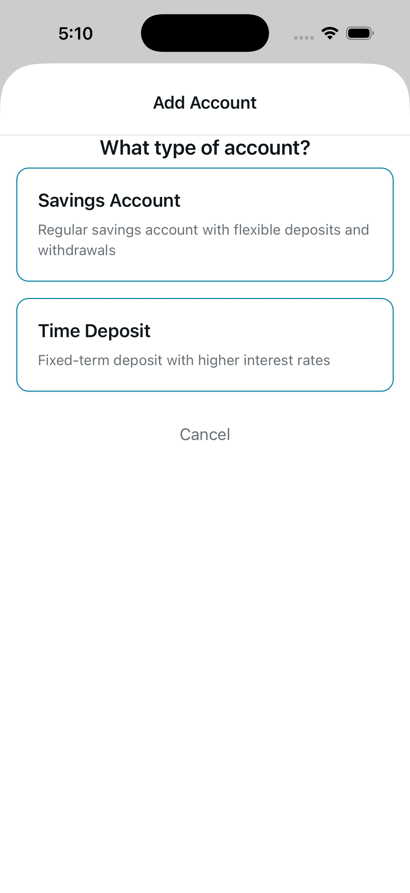
</p>
<p align="center">
  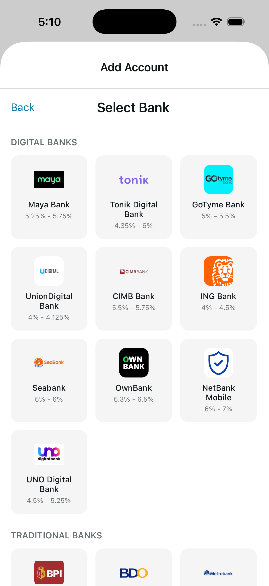
  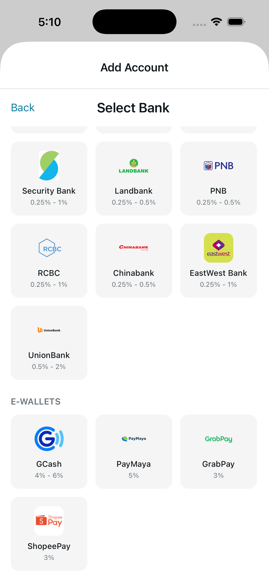
</p>

### Budget Management
<p align="center">
  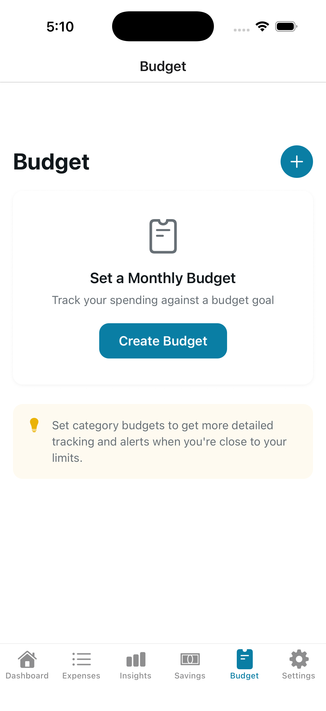
  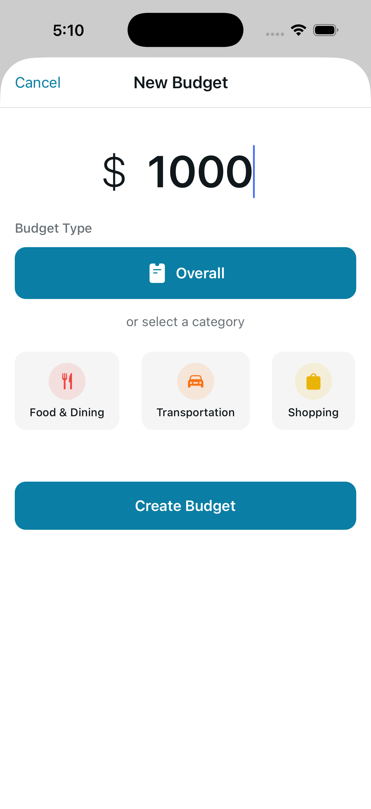
  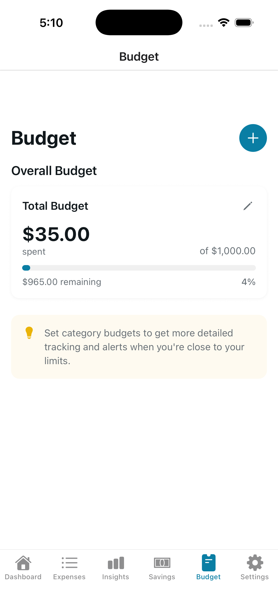
</p>

### Settings
<p align="center">
  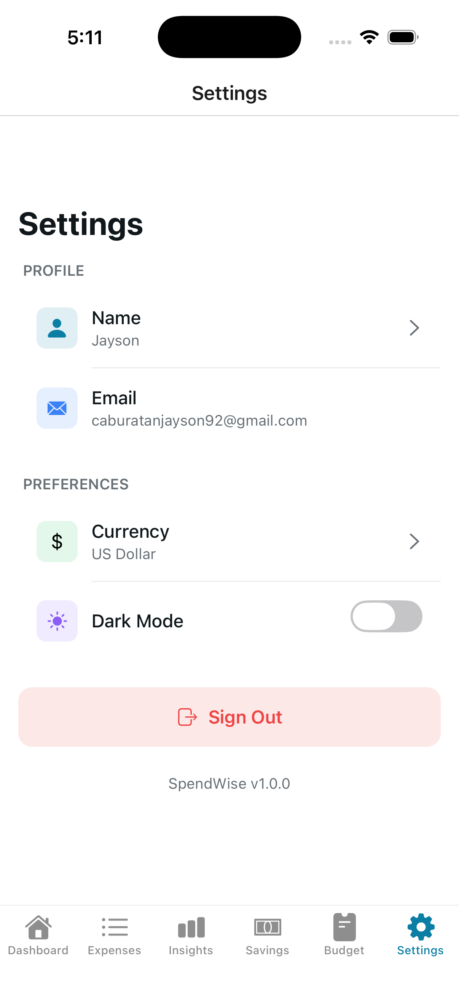
</p>

## Features

### Expense Tracking
- Add, edit, and delete expenses with amount, description, date, and notes
- **AI-powered category auto-detection** - automatically suggests a category based on your expense description
- 12 built-in categories: Food & Dining, Transportation, Shopping, Entertainment, Bills & Utilities, Healthcare, Travel, Education, Personal Care, Groceries, Subscriptions, and Other
- Create custom categories with your own icons and colors
- Calendar view with daily spending indicators
- List view sorted by date
- Link expenses to savings accounts for tracking withdrawals

### Savings Management
- Track multiple savings accounts across 23+ banks and e-wallets
- Supported institutions include BPI, BDO, Metrobank, Maya Bank, GCash, Tonik, SeaBank, and more
- Record deposits, withdrawals, and interest transactions
- View total balance across all accounts with privacy toggle (hide amounts)
- Track interest rates and maturity dates for time deposits
- Detailed transaction history per account

### Budget Management
- Set an overall monthly spending budget
- Create category-specific budgets (e.g., limit Food & Dining to a set amount)
- Visual progress bars showing budget utilization
- Dashboard integration showing budget status at a glance

### AI-Powered Insights
- **Smart Category Detection** - uses OpenAI GPT-4o-mini to auto-categorize expenses based on description
- **Spending Pattern Analysis** - identifies trends and recurring expenses
- **Budget Predictions** - forecasts next month's spending with confidence levels
- **Actionable Tips** - AI-generated savings suggestions based on your habits
- Insights auto-expire after 7 days to stay fresh and relevant

### Analytics & Charts
- Spending by category breakdown with percentage bars
- 6-month spending trend chart
- Monthly spending summary with transaction count
- Average, highest, and total spending stats

### Dashboard
- Personalized greeting with current date
- Monthly spending summary card
- Recent expenses quick view
- Quick-add floating action button

### Settings & Personalization
- Dark mode support
- Multi-currency support: PHP, USD, EUR, GBP, JPY, CAD, AUD
- Edit display name
- Haptic feedback throughout the app

## Tech Stack

| Technology | Purpose |
|---|---|
| **React Native + Expo** | Cross-platform mobile framework |
| **Expo Router** | File-based navigation |
| **Convex** | Real-time backend database & serverless functions |
| **Clerk** | Authentication (email/password with verification) |
| **OpenAI GPT-4o-mini** | AI categorization & financial insights |
| **Victory Native** | Charts and data visualization |

## Getting Started

### Prerequisites

- Node.js (v18+)
- npm or yarn
- Expo CLI
- iOS Simulator or Android Emulator (or Expo Go on a physical device)

### Installation

1. Clone the repository

   ```bash
   git clone https://github.com/yourusername/spend-wise.git
   cd spend-wise
   ```

2. Install dependencies

   ```bash
   npm install
   ```

3. Set up environment variables

   Create a `.env` file in the root directory:

   ```env
   EXPO_PUBLIC_CLERK_PUBLISHABLE_KEY=your_clerk_publishable_key
   EXPO_PUBLIC_CONVEX_URL=your_convex_url
   CLERK_SECRET_KEY=your_clerk_secret_key
   ```

4. Start the Convex development server

   ```bash
   npx convex dev
   ```

5. Start the app

   ```bash
   npx expo start
   ```

6. Open in simulator
   - Press `s` to switch to Expo Go
   - Press `i` for iOS simulator
   - Press `a` for Android emulator
   - Press `w` for web

## Project Structure

```
spend-wise/
├── app/                    # Screens & navigation (file-based routing)
│   ├── (tabs)/             # Main tab screens
│   │   ├── index.tsx       # Dashboard
│   │   ├── expenses.tsx    # Expense list & calendar
│   │   ├── insights.tsx    # AI insights & charts
│   │   ├── savings.tsx     # Savings overview
│   │   ├── budget.tsx      # Budget management
│   │   └── settings.tsx    # App settings
│   ├── expense/            # Add/edit expense screens
│   ├── savings/            # Savings detail & transaction screens
│   └── _layout.tsx         # Root layout with auth & providers
├── convex/                 # Backend functions
│   ├── expenses.ts         # Expense CRUD & queries
│   ├── budgets.ts          # Budget management
│   ├── savings.ts          # Savings accounts & transactions
│   ├── ai.ts               # AI categorization & insights
│   ├── insights.ts         # Insights storage & retrieval
│   ├── banks.ts            # Bank data & seeding
│   ├── categories.ts       # Category management
│   └── auth.ts             # User authentication helpers
├── components/             # Reusable UI components
├── constants/              # Theme colors & configuration
└── assets/                 # Images, icons & fonts
```

## License

This project is for personal use.
